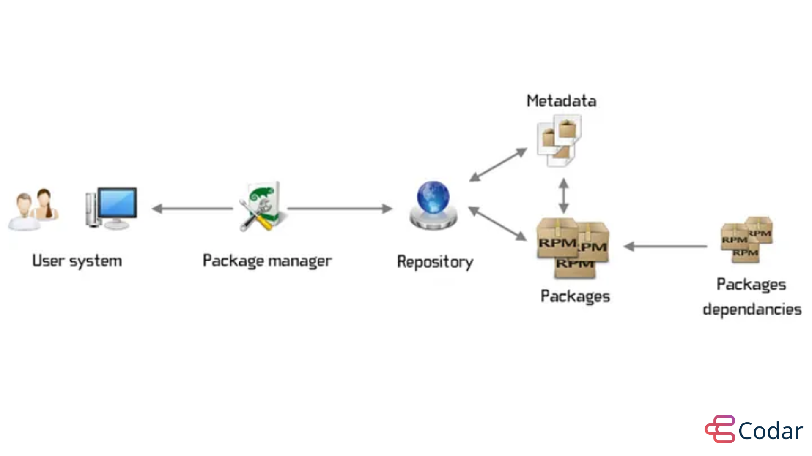

# Package Managers in Linux



## 📌 What is a Package Manager?
A **package manager** is a tool that automates the process of installing, updating, configuring, and removing software in a Linux system. It ensures that software and its dependencies are managed efficiently.

## 🔍 How Does a Package Manager Work?
1. **Repositories (Repos):**
   - A package manager fetches software from **official repositories (online storage of packages).**
   - Example: Ubuntu gets packages from `archive.ubuntu.com`.

2. **Installing Software:**
   - When you install software, the package manager:
     - ✅ Downloads the package from the repository.
     - ✅ Resolves dependencies (installs additional required software).
     - ✅ Installs and configures the software automatically.

3. **Updating Software:**
   - A single command updates all installed packages to the latest version.

4. **Removing Software:**
   - The package manager also **removes** software cleanly without leaving unnecessary files.

## 📦 Popular Package Managers in Linux
| Linux Distro   | Package Manager | Command Example |
|---------------|----------------|----------------|
| Ubuntu, Debian | `apt` (Advanced Package Tool) | `sudo apt install nginx` |
| Fedora, RHEL, CentOS | `dnf` (or `yum` for older versions) | `sudo dnf install nginx` |
| Arch Linux | `pacman` | `sudo pacman -S nginx` |
| OpenSUSE | `zypper` | `sudo zypper install nginx` |

## 🌍 How Package Managers Fetch Software from Repositories
A **repository** is a server that stores software packages. When a package manager installs software:

1. It **checks the repository list** (e.g., `/etc/apt/sources.list` in Ubuntu).
2. It **downloads the package** and its dependencies.
3. It **installs and configures the software** automatically.

### 📁 Example of an Ubuntu Repository Entry
```plaintext
Types: deb
URIs: http://ports.ubuntu.com/ubuntu-ports/
Suites: noble noble-updates noble-backports noble-security
Components: main universe restricted multiverse
Signed-By: /usr/share/keyrings/ubuntu-archive-keyring.gpg
```

## 🔄 Why Should You Run `apt update` After Installing Ubuntu?
When you install Ubuntu, the packages included in the ISO image might be outdated. Running:
```bash
apt install sudo
sudo apt update
```
✅ Updates the package list from repositories.

Then, to install the latest versions of packages, run:
```bash
sudo apt upgrade -y
```

## 🛠 Essential Package Manager Commands
### **APT (Debian, Ubuntu)**
```bash
sudo apt update         # Update package lists
sudo apt upgrade -y     # Upgrade installed packages
sudo apt install nginx  # Install a package
sudo apt remove nginx   # Remove a package
sudo apt autoremove     # Remove unused dependencies
sudo apt search nginx   # Search for a package
```

### **DNF (Fedora, RHEL, CentOS)**
```bash
sudo dnf check-update   # Check for updates
sudo dnf update         # Update all packages
sudo dnf install nginx  # Install a package
sudo dnf remove nginx   # Remove a package
```

### **Pacman (Arch Linux)**
```bash
sudo pacman -Syu        # Sync and update all packages
sudo pacman -S nginx    # Install a package
sudo pacman -R nginx    # Remove a package
```

### **Zypper (OpenSUSE)**
```bash
sudo zypper refresh     # Refresh package list
sudo zypper update      # Update all packages
sudo zypper install nginx  # Install a package
sudo zypper remove nginx   # Remove a package
```

## 🚀 Best Practices for Using Package Managers
- ✅ **Always update your package list before installing software:**
  ```bash
  sudo apt update && sudo apt upgrade -y
  ```
- ✅ **Use `autoremove` to clean up unused dependencies:**
  ```bash
  sudo apt autoremove
  ```
- ✅ **Enable automatic security updates (Ubuntu):**
  ```bash
  sudo apt install unattended-upgrades
  sudo dpkg-reconfigure unattended-upgrades
  ```

---
This document provides a solid foundation for understanding package managers in Linux! 🚀