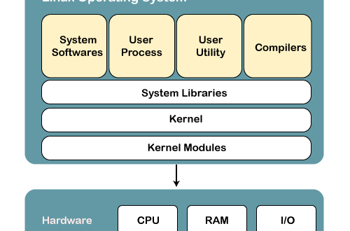

# Linux Core Components Structure



```bash
+----------------------------------------------------+
| User Applications (Vim, Docker, Apache, etc.)     |
+----------------------------------------------------+
| Shell (Bash, Zsh, Fish, etc.)                     |  <-- Part of the OS
+----------------------------------------------------+
| System Libraries (glibc, libc, OpenSSL, etc.)     |  <-- Part of the OS
+----------------------------------------------------+
| System Utilities (ls, grep, systemctl, etc.)      |  <-- Part of the OS
+----------------------------------------------------+
| Linux Kernel (Process, Memory, FS, Network)       |  <-- Core of the OS
+----------------------------------------------------+
| Hardware (CPU, RAM, Disk, Network, Peripherals)   |
+----------------------------------------------------+
```

(a) Hardware Layer

🔹 The physical components of the computer (CPU, RAM, disk, network interfaces, etc.).
🔹 The OS interacts with hardware using device drivers.
(b) Kernel (Core of Linux OS)

🔹 The Linux Kernel is responsible for directly managing system resources, including:

    Process Management – Schedules processes and handles multitasking.

    Memory Management – Allocates and deallocates RAM efficiently.

    Device Drivers – Acts as an interface between software and hardware.

    File System Management – Manages how data is stored and retrieved.

    Network Management – Handles communication between systems.

(c) Shell (Command Line Interface - CLI)

🔹 A command interpreter that allows users to interact with the kernel.
🔹 Examples: Bash, Zsh, Fish, Dash, Ksh.
🔹 Converts user commands into system calls for the kernel.
(d) User Applications

🔹 End-user programs like web browsers, text editors, DevOps tools, etc.
🔹 Applications interact with the OS using system calls via the shell or GUI.