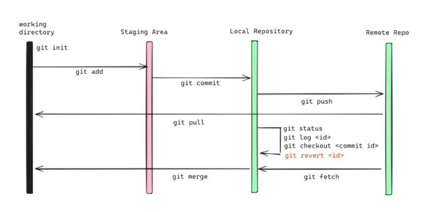

## Git Basics

We'll create our first  repository - Hello World and learn GitHub's pull request workflow, a popular way to create and review code.

## GitHub essentials 

- **Repository**: A container where all the files of a project are stored along with their history. Also commonly called a "repo".
- **Diff**: The delta (additions and deletions) between two states of a project.
- **Commit**: A snapshot of your project’s state at a point in history. Records the difference between two points in history with a diff.
- **Branch**: Modifications to a project (main branch = trunk) made in parallel with the a main branch, but not affecting the main branch.
- **Merge**: Introducing changes from one branch into another.
- **Clone**: Downloading a local copy of a project.
- **Fork**: Your own version of somebody else’s project where you take the original code-base and make modifications. 

## Git Workflow



## Basic Git commands
To use Git, developers use specific commands to copy, create, change, and combine code. These commands can be executed directly from the command line or by using an application like GitHub Desktop. Here are some common commands for using Git:

- `git init`:  initializes a brand new Git repository and begins tracking an existing directory. It adds a hidden subfolder within the existing directory that houses the internal data structure required for version control.

    ```bash
    git init 
    ```

- `git status`:  shows the status of changes as untracked, modified, or staged.

    ```bash
    git status 
    ```

- `git branch`: In Git, a branch is like a separate workspace where you can make changes and try new ideas without affecting the main project.
    ```bash
    git branch <new_branch> # create new branch
    git branch # list all branch
    git checkout <another_branch>  # check out of a branch.
    git branch -d <old_branch> # delete existing branch
    git branch -m <old-name> <new-name> # rename a branch
    ```

- `git add`: stages a change. Git tracks changes to a developer's codebase, but it's necessary to stage and take a snapshot of the changes to include them in the project's history. This command performs staging, the first part of that two-step process

    ```bash
    git add <file> # Stage a file
    git add --all or git add -A or git add . # Stage all changes
    git restore --staged <file> # Unstage a file
    ```

- `git commit`: saves the snapshot to the project history and completes the change-tracking process. In short, a commit functions like taking a photo. Anything that's been staged with `git add` will become a part of the snapshot with `git commit`.

    ```bash
    git commit -m "message" # Commit staged changes with a message
    git commit -a -m "message" # Commit all tracked changes (skip staging)
    ```

- `git log`: Git keeps a detailed record of every change made to your project. You can use history commands to see what changed, when, and who made the change. This is useful for tracking progress, finding bugs, and understanding your project's evolution.
    ```bash
    git log # Show full commit history
    git log --oneline # Show a summary of commits
    git log --author="Ola" # See only the commits made by a specific author:
    git log --since="2 weeks ago" # See only commits made in the last two weeks
    git log --stat # See which files were changed in each commit and how many lines were added or removed.
    git log --graph #
    git show <commit> # Show details of a specific commit
    git diff # See unstaged changes
    git diff --staged # See staged changes
    ```


- `git push`: updates the remote repository with any commits made locally to a branch.

    ```bash
    git push origin <branch_name>
    git push --force origin <branch_name>
    ``

# Git Best Practices
1. Make small, frequent commits to capture your progress. This makes it easier to track changes and find bugs.
2. Write descriptive commit messages, this help you and your team understand the history of the project.
3. Adopt a branch strategy. This way, you can work on new ideas without affecting the main codebase.
4. Always git pull before pushing. This updates your local branch with changes from others, helps you avoid conflicts, and ensures your push will succeed.
5. Use git status and git diff to review your changes before you commit. This helps you catch mistakes early.
6. Use `.gitignore` to exclude files that shouldn't be tracked (like build artifacts, log files, or secrets) by adding them to a .gitignore file.
7. Use `README.md` file to provide detailed documentation of your projects. 


