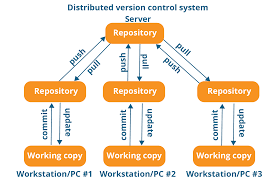

# Git and Github

## Table of contents
- Introduction to Version Control Systems (VCS)
- Types of Version Control System (VCS)
- Introduction to Git and Github
- Installation and Setting up Git 
- Github Account Creation and Set Up
- Git Workflow
- Git Common Commands
- Working with tagging
- Working with branches
- Merging Branches
- Resolving Merge Conflict


## Version Control System (VPC)
**Version control**, also known as source control, is the practice of tracking and managing changes to software code. Version control systems are software tools that help software teams manage changes to source code over time. As development environments have accelerated, version control systems help software teams work faster and smarter.
They are especially useful for DevOps teams since they help them to reduce development time and increase successful deployments.

Version control software keeps track of every modification to the code in a special kind of database. If a mistake is made, developers can turn back the clock and compare earlier versions of the code to help fix the mistake while minimizing disruption to all team members.

## Why Version Control System
1. **Traceability**: Being able to trace each change made to the software and connect it to project management and bug tracking software such as Jira,
2. **Collaboration**: Branching and merging. Having team members work concurrently is a no-brainer, but even individuals working on their own can benefit from the ability to work on independent streams of changes
3. **Accountability**: Links code to decisions, contributions, contributors, and time.
4. **Reduces errors**: We can easily identify and fix errors in code with minimal disruption to collaborators.
5. **High availability**: We can immediately switch to an earlier version of code without interrupting the work of others.


## Centralized Version Control System (CVCS) Versus Distributed Version Control System (DVCS)

* **Centralized Version Control System (CVCS)**


Centralized version control systems are based on the idea that there is a single “central” copy of your project somewhere (probably on a server), and programmers will “commit” their changes to this central copy.

Some of the most common centralized version control systems you may have heard of or used are, Subversion (or SVN) and Perforce.

* **Distributed Version Control System (DVCS)**


In distributed version control, every developer “clones” a copy of a repository and has the full history of the project on their own hard drive. This copy (or “clone”) has all of the metadata of the original.

The three most popular of these are Git and Mercurial


## Git and Github

### Git

Git is as an open source project by Linus Torvalds created in 2005 

Git is a popular DVCS due to its flexibility, speed, and powerful branching and merging capabilities. It provides us with a rich set of features such as allowing many individuals to collaborate remotely on a software-based project, with the full power of a version control system.

Alternatives to Git include `Mercurial`, `Bazaar`, and `Darcs`. While Git is widely adopted, the choice between version control systems often depends on factors such as personal preference, project requirements, and the specific needs of the development team.


### Github
GitHub is a cloud-based platform where you can store, share, and work together with others to write code.

Storing your code in a "repository" on GitHub allows you to:

- Showcase or share your work.
- Track and manage changes to your code over time.
- Let others review your code, and make suggestions to improve it.
- Collaborate on a shared project, without worrying that your changes will impact the work of your collaborators before you're ready to integrate them.

Collaborative working, one of GitHub’s fundamental features, is made possible by the open-source software, Git, upon which GitHub is built.


## How do Git and GitHub work together?

When you upload files to GitHub, you'll store them in a "Git repository." This means that when you make changes (or "commits") to your files in GitHub, Git will automatically start to track and manage your changes.

There are plenty of Git-related actions that you can complete on GitHub directly in your browser, such as creating a Git repository, creating branches, and uploading and editing files.

However, most people work on their files locally (on their own computer), then continually sync these local changes—and all the related Git data—with the central "remote" repository on GitHub. There are plenty of tools that you can use to do this, such as GitHub Desktop.

Once you start to collaborate with others and all need to work on the same repository at the same time, you’ll continually:

- **Pull** all the latest changes made by your collaborators from the remote repository on GitHub.
- **Push** back your own changes to the same remote repository on GitHub.

Git figures out how to intelligently merge this flow of changes, and GitHub helps you manage the flow through features such as "pull requests."

## Installation

- **Step 1**: You can download Git for free https://git-scm.com/downloads

Alternatively using package managers:
```bash

# windows
choco install git

# linux (debian/ubuntu)
sudo apt-get install git

# macOS
brew install git
```

- **Step 2**: Creating an account on GitHub
To get started with GitHub, you'll need to create a free personal account and verify your email address.

create an account at  https://github.com/

## Verifying Your Installation
```bash
git --version
```
If Git is installed, you will see something like `git version X.Y.Z`


## Git Configuration
It is important to let Git know who you are, as each Git commit uses this information. Git uses your name and email to label your commits.


```bash
git config --global user.name "My Name"
git config --global user.email "myself@gmail.com"
```